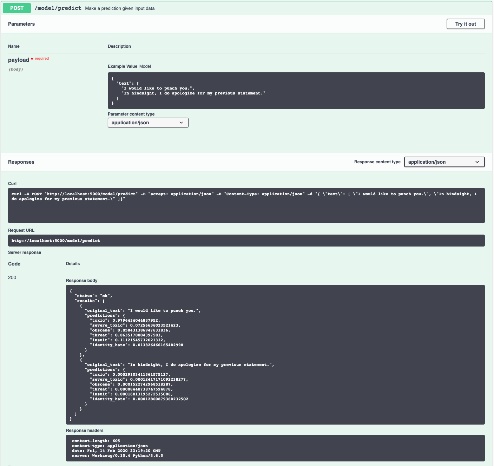

[](https://travis-ci.com/IBM/MAX-Toxic-Comment-Classifier) [](http://max-toxic-comment-classifier.max.us-south.containers.appdomain.cloud/)

# IBM Developer Model Asset Exchange: Toxic Comment Classifier

This repository contains code to instantiate and deploy a toxic comment classifier. This model is able to detect 6 types of toxicity in a text fragment. The six detectable types are toxic, severe toxic, obscene, threat, insult, and identity hate.

The model is based on the [pre-trained BERT-Base, English Uncased](https://github.com/google-research/bert/blob/master/README.md) model and was finetuned on the [Toxic Comment Classification Dataset](https://www.kaggle.com/c/jigsaw-toxic-comment-classification-challenge/data) using the [Huggingface BERT Pytorch repository](https://github.com/huggingface/pytorch-pretrained-BERT). The model files are hosted on
[IBM Cloud Object Storage](http://max-assets.s3.us.cloud-object-storage.appdomain.cloud/max-toxic-comment-classifier/1.0/assets.tar.gz).
The code in this repository deploys the model as a web service in a Docker container. This repository was developed
as part of the [IBM Developer Model Asset Exchange](https://developer.ibm.com/exchanges/models/).

A brief definition of the six different toxicity types can be found below.

```
Toxic: very bad, unpleasant, or harmful

Severe toxic: extremely bad and offensive

Obscene: (of the portrayal or description of sexual matters) offensive or disgusting by accepted standards of morality and decency

Threat: a statement of an intention to inflict pain, injury, damage, or other hostile action on someone in retribution for something done or not done

Insult: speak to or treat with disrespect or scornful abuse

Identity hate: hatred, hostility, or violence towards members of a race, ethnicity, nation, religion, gender, gender identity, sexual orientation or any other designated sector of society
```

## Model Metadata
| Domain | Application | Industry  | Framework | Training Data | Input Data |
| --------- | --------  | -------- | --------- | --------- | --------------- | 
| Natural Language Processing (NLP) | Text Classification | General | PyTorch | [Toxic Comment Classification Dataset](https://www.kaggle.com/c/jigsaw-toxic-comment-classification-challenge/data) | Text |

## Benchmark

This model achieves a column-wise ROC AUC score of 0.98355 (private score) in the [Kaggle Toxic Comment Classification Competition](https://www.kaggle.com/c/jigsaw-toxic-comment-classification-challenge). This implementation is trained with a maximum sequence length of 256 instead of 512 to have higher inference speed. For most applications outside of this Kaggle competition, a sequence length of 256 is more than sufficient.

## References
* _J. Devlin, M. Chang, K. Lee, K. Toutanova_, [BERT: Pre-training of Deep Bidirectional Transformers for Language Understanding](https://arxiv.org/abs/1810.04805), arXiv, 2018.
* [Google BERT repository](https://github.com/google-research/bert)
* [Huggingface BERT Pytorch repository](https://github.com/huggingface/pytorch-pretrained-BERT)
* [Multi-Label Text Classification using BERT - The Mighty Transformer](https://medium.com/huggingface/multi-label-text-classification-using-bert-the-mighty-transformer-69714fa3fb3d)
* [Kaggle Toxic Comment Classification](https://www.kaggle.com/c/jigsaw-toxic-comment-classification-challenge)

## Licenses
| Component | License | Link  |
| ------------- | --------  | -------- |
| This repository | [Apache 2.0](https://www.apache.org/licenses/LICENSE-2.0) | [LICENSE](https://github.com/IBM/MAX-Toxic-Comment-Classifier/blob/master/LICENSE) |
| Finetuned Model Weights | [Apache 2.0](https://www.apache.org/licenses/LICENSE-2.0) | [LICENSE](https://github.com/IBM/MAX-Toxic-Comment-Classifier/blob/master/LICENSE) |
| Pre-trained Model Weights | [Apache 2.0](https://www.apache.org/licenses/LICENSE-2.0) | [LICENSE](https://github.com/google-research/bert/blob/master/LICENSE) |
| TensorFlow Model Code (3rd party) | [Apache 2.0](https://www.apache.org/licenses/LICENSE-2.0) | [LICENSE](https://github.com/google-research/bert/blob/master/LICENSE) |
| PyTorch Model Code (3rd party) | [Apache 2.0](https://www.apache.org/licenses/LICENSE-2.0) | [LICENSE](https://github.com/huggingface/pytorch-pretrained-BERT/blob/master/LICENSE) |
| Toxic Comment Classification Dataset | [CC0](https://creativecommons.org/share-your-work/public-domain/cc0/) | [LICENSE](https://www.kaggle.com/c/jigsaw-toxic-comment-classification-challenge/data) |

## Pre-requisites:
* `docker`: The [Docker](https://www.docker.com/) command-line interface. Follow the [installation instructions](https://docs.docker.com/install/) for your system.
* The minimum recommended resources for this model is 4GB Memory and 4 CPUs.

# Steps
1. [Deploy from Docker Hub](#deploy-from-docker-hub)
2. [Deploy on Kubernetes](#deploy-on-kubernetes)
3. [Run Locally](#run-locally)

## Deploy from Docker Hub
To run the docker image, which automatically starts the model serving API, run:

```
$ docker run -it -p 5000:5000 codait/max-toxic-comment-classifier
```

This will pull a pre-built image from Docker Hub (or use an existing image if already cached locally) and run it.
If you'd rather checkout and build the model locally you can follow the [run locally](#run-locally) steps below.

## Deploy on Kubernetes
You can also deploy the model on Kubernetes using the latest docker image on Docker Hub.

On your Kubernetes cluster, run the following commands:

```
$ kubectl apply -f https://github.com/IBM/MAX-Toxic-Comment-Classifier/raw/master/max-toxic-comment-classifier.yaml
```

The model will be available internally at port `5000`, but can also be accessed externally through the `NodePort`.

## Run Locally
1. [Build the Model](#1-build-the-model)
2. [Deploy the Model](#2-deploy-the-model)
3. [Use the Model](#3-use-the-model)
4. [Development](#4-development)
5. [Cleanup](#5-cleanup)


### 1. Build the Model
Clone this repository locally. In a terminal, run the following command:

```
$ git clone https://github.com/IBM/MAX-Toxic-Comment-Classifier.git
```

Change directory into the repository base folder:

```
$ cd MAX-Toxic-Comment-Classifier
```

To build the docker image locally, run: 

```
$ docker build -t max-toxic-comment-classifier .
```

All required model assets will be downloaded during the build process. _Note_ that currently this docker image is CPU only (we will add support for GPU images later).


### 2. Deploy the Model
To run the docker image, which automatically starts the model serving API, run:

```
$ docker run -it -p 5000:5000 max-toxic-comment-classifier
```

### 3. Use the Model

The API server automatically generates an interactive Swagger documentation page. Go to `http://localhost:5000` to load it. From there you can explore the API and also create test requests.

```
Example:
{
  "text": [
    "I would like to punch you.",
    "In hindsight, I do apologize for my previous statement."
  ]
}

Result:
{
  "status": "ok",
  "predictions": [
    {
      "toxic": 0.9796434044837952,
      "severe_toxic": 0.07256636023521423,
      "obscene": 0.058431386947631836,
      "threat": 0.8635178804397583,
      "insult": 0.11121545732021332,
      "identity_hate": 0.013826466165482998
    },
    {
      "toxic": 0.00029103411361575127,
      "severe_toxic": 0.00012417171092238277,
      "obscene": 0.0001522742968518287,
      "threat": 0.00008440738747594878,
      "insult": 0.00016013195272535086,
      "identity_hate": 0.00012860879360232502
    }
  ]
}
```


Use the ```model/predict``` endpoint to submit input text in json format. The JSON structure should have one key, ```text```, with as value a list of input strings to be analyzed. An example can be found in the image below.

Submitting proper json data triggers the model and will return a json file with a ```status``` and a ```predictions``` key. With this ```predictions``` field, a list of class labels and their corresponding probabilities will be associated. The first element in the list corresponds to the prediction for the first string in the input list.




You can also test it on the command line, for example:

```
$ curl -d "{ \"text\": [ \"I would like to punch you.\", \"In hindsight, I do apologize for my previous statement.\" ]}" -X POST "http://localhost:5000/model/predict" -H "Content-Type: application/json"
```

You should see a JSON response like that below:

```json
{
  "status": "ok",
  "predictions": [
    {
      "toxic": 0.9796434044837952,
      "severe_toxic": 0.07256636023521423,
      "obscene": 0.058431386947631836,
      "threat": 0.8635178804397583,
      "insult": 0.11121545732021332,
      "identity_hate": 0.013826466165482998
    },
    {
      "toxic": 0.00029103411361575127,
      "severe_toxic": 0.00012417171092238277,
      "obscene": 0.0001522742968518287,
      "threat": 0.00008440738747594878,
      "insult": 0.00016013195272535086,
      "identity_hate": 0.00012860879360232502
    }
  ]
}
```

### 4. Development
To run the Flask API app in debug mode, edit `config.py` to set `DEBUG = True` under the application settings. You will then need to rebuild the docker image (see [step 1](#1-build-the-model)).

### 5. Cleanup
To stop the Docker container, type `CTRL` + `C` in your terminal.
